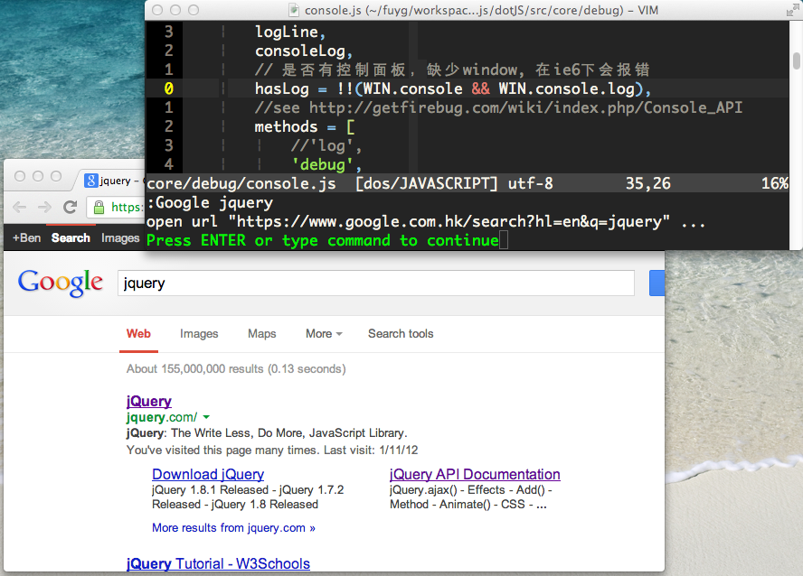
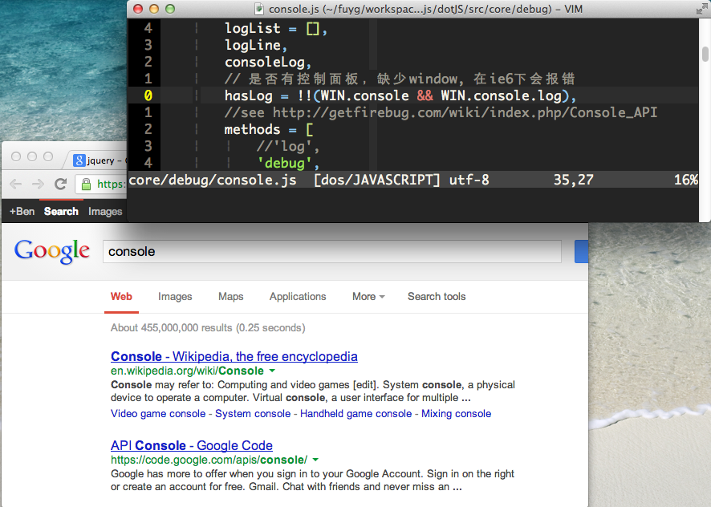

WebSearch.vim
=============

Integrate web search engines, such as Google ,  with vim

##Usage

The general usage is: `:WebSearch engineName keyword1 keyword2 ...`. For
example:

```vim
:WebSearch google keyword1 keyword2 ...
:WebSearch baidu keyword1 keyword2 ...
```
By default, `google`, `baidu` and `mdn` is available without configuration, so
you can search something with these engine shortly:

```vim
:Google keyword1 keyword2 ...
:Baidu keyword1 keyword2 ...
:Mdn keyword1 keyword2 ...
```

Also, there are shortcuts to search the word under cursor:

* `<leader>gg` to search the word under cursor with google.

* `<leader>bd` to search the word under cursor with baidu.

* `<leader>mz` to search the word under cursor with mdn.

##Custom Search Engines

You can config `g:webSearchEngines` to add web search engines in `.vimrc`.
e.g.

```vim
let g:webSearchEngines = {
    \ 'github': 'https://github.com/search?q=<QUERY>'
    \ }
```

Then you can use this command:

```vim
:WebSearch github keyword1 keyword2 ...
```

The `<QUERY>` will be replaced with the keywords when you are searching.

##Screenshots

Screenshot for `:Google jquery`:


Screenshot for `<leader>gg` when the cursor on the word of `console`:



